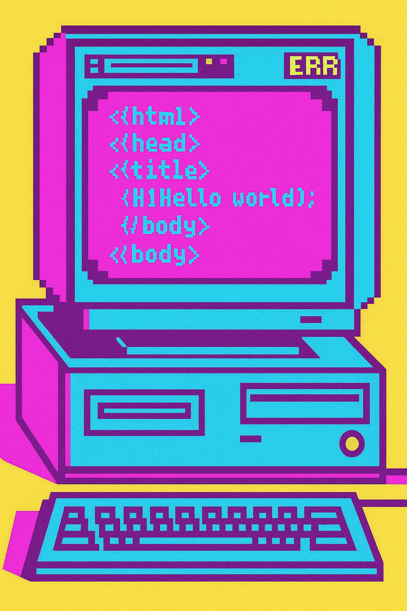

## 👀 Hello, I'm Ali

    
     
    
Art & Technology, embrace what we cloud've have in our lives. True time machine.

## Who am i?

🎨💻 A Frontend React Developer who loves to show various aspects of technologies on an interface to you.

Yes, I simplify the complexity for you. Yes, that is my job.

---

### 🧰 Tech Stack

| Programming Languages |  |
| --- | --- |
| JavaScript | TypeScript |

| Frontend Technologies | | | 
| ---  | --- | ---  |  
| HTML  | CSS | Scss | 
| React.js | Redux | Next.js | 
| Webpack | Module Federation | Vite |
| Chart.js | Video.js | Three.js |

| Testing |  |
| --- | --- |
| Cypress | React Testing Library |

| End-to-end |
| --- |
| RESTful APIs |

---

### 👨🏻‍💻 Some Codes? 

- <a href="https://github.com/aliNzLami/dreamNote"> Multilingual Landing Page </a>

- <a href="https://github.com/aliNzLami/gameShop"> Video Game E-Commerce </a>

- <a href="https://github.com/aliNzLami/light_banking"> Banking Web Application</a>

